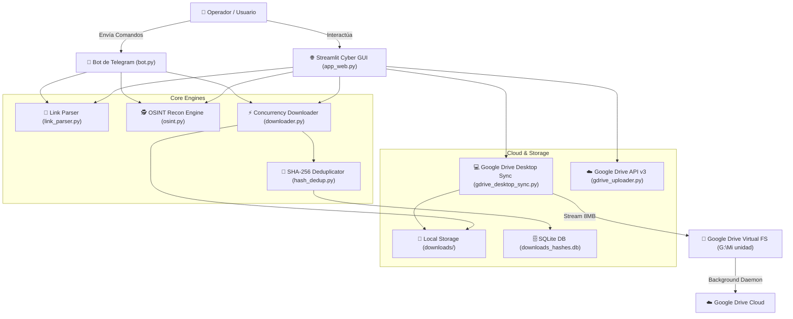

# 🤖 AGENTS.MD - ARQUITECTURA TÉCNICA, ESPECIFICACIONES Y DIRECTRICES

> **TELEGRAM OSINT RECON MATRIX & HIGH-SPEED MEDIA EXTRACTOR**  
> **Autor & Creador:** `@lukgtz` (Luciano Gutiérrez - Salta, Argentina)  
> **Propósito del Documento:** Servir como base de conocimiento técnico integral, registro de decisiones de arquitectura y guía operativa para cualquier agente de IA o desarrollador que mantenga, extienda o refactorice este sistema.

---

## 🧭 1. VISIÓN GENERAL DEL SISTEMA

El sistema es una plataforma híbrida de **Extracción Masiva de Multimedia, Análisis OSINT y Sincronización en la Nube**, diseñada para operar tanto como un **Bot interactivo de Telegram** como una **Consola Web Táctica (Streamlit)** con estética Cyber Terminal.

### 📐 Diagrama de Arquitectura

---

## 📂 2. ESPECIFICACIÓN DE MÓDULOS

| Módulo | Responsabilidad Principal | Dependencias Clave |
| :--- | :--- | :--- |
| [`app_web.py`](file:///c:/Users/LukGutierrez/Desktop/Bot%20Telegram/app_web.py) | Interfaz Web interactiva con 6 pestañas, métricas en vivo, temas OLED `#050505` y control asíncrono. | `streamlit`, `pandas`, `telethon` |
| [`bot.py`](file:///c:/Users/LukGutierrez/Desktop/Bot%20Telegram/bot.py) | Servidor de comandos de Telegram (`/start`, `/dl`, `/batch`, `/topics`, `/alltopics`, `/info`, `/stats`, etc.). | `telethon` |
| [`downloader.py`](file:///c:/Users/LukGutierrez/Desktop/Bot%20Telegram/downloader.py) | Motor de descarga concurrente con semáforos (`asyncio.Semaphore`), sanitización de nombres y reintentos. | `telethon`, `asyncio`, `cryptg` |
| [`osint.py`](file:///c:/Users/LukGutierrez/Desktop/Bot%20Telegram/osint.py) | Extracción de metadatos, inspección de canales/usuarios, conteo de medios, análisis de horarios pico y búsqueda de palabras clave. | `telethon` |
| [`link_parser.py`](file:///c:/Users/LukGutierrez/Desktop/Bot%20Telegram/link_parser.py) | Parser robusto para enlaces públicos, privados (`t.me/c/...`), IDs numéricos (`-100...`) y usernames. | `re`, `telethon` |
| [`hash_dedup.py`](file:///c:/Users/LukGutierrez/Desktop/Bot%20Telegram/hash_dedup.py) | Motor de deduplicación SQLite con cálculo de hashes SHA-256 en bloques de 64KB para evitar descargas redundantes. | `sqlite3`, `hashlib` |
| [`gdrive_desktop_sync.py`](file:///c:/Users/LukGutierrez/Desktop/Bot%20Telegram/gdrive_desktop_sync.py) | Copia de alta velocidad por bloques (8MB) hacia `G:\Mi unidad` con cálculo en vivo de MB/s, ETA y conteo de archivos. | `os`, `shutil`, `time` |
| [`gdrive_uploader.py`](file:///c:/Users/LukGutierrez/Desktop/Bot%20Telegram/gdrive_uploader.py) | Cliente Google Drive API v3 oficial con subida reanudable por bloques (`MediaFileUpload` 64MB/128MB). | `googleapiclient`, `google-auth` |
| [`proxy_manager.py`](file:///c:/Users/LukGutierrez/Desktop/Bot%20Telegram/proxy_manager.py) | Enrutador de conexiones seguras SOCKS5 / MTProto para evasión de bloqueos y anonimato. | `pocks`, `telethon` |
| [`config.py`](file:///c:/Users/LukGutierrez/Desktop/Bot%20Telegram/config.py) | Cargador dinámico de entorno con fallback a `.env` (`python-dotenv`). | `dotenv`, `os` |

---

## 🧠 3. DECISIONES DE ARQUITECTURA CRÍTICAS (ADR)

### ADR-001: Desacoplamiento de Sesiones SQLite en Streamlit (`MemorySession`)
- **Problema:** Telethon usa por defecto `SQLiteSession`, que bloquea el archivo `.session` en disco. Cuando Streamlit re-ejecuta scripts en hilos independientes o el usuario interactúa simultáneamente con el bot, SQLite lanzaba `sqlite3.OperationalError: database is locked`.
- **Solución implementada:** En [`app_web.py`](file:///c:/Users/LukGutierrez/Desktop/Bot%20Telegram/app_web.py#L250-L267), se abre la sesión SQLite temporalmente para leer la clave de autenticación (`auth_key`), el DC (`dc_id`) y el puerto, transfiriéndolos a una instancia de `MemorySession()`. El cliente opera en memoria sin bloquear archivos en disco.

### ADR-002: Loop Asíncrono en Hilo Dedicado de Fondo
- **Problema:** Streamlit destruye y crea loops de asyncio por cada ciclo de ejecución de la interfaz, lo que causaba `RuntimeError: Event loop is closed` al ejecutar corrutinas de Telethon.
- **Solución implementada:** Se crea un singleton de bucle de eventos (`get_background_loop()`) que corre indefinidamente en un `threading.Thread(daemon=True)`. Toda tarea asíncrona de la GUI se despacha usando `asyncio.run_coroutine_threadsafe()` y se sincroniza el contexto de Streamlit mediante `add_script_run_ctx()`.

### ADR-003: Deduplicación Doble-Capa (Identificador + Hash SHA-256)
- **Capa 1 (Rápida - O(1)):** Nombres de archivo deterministas basados en fecha y mensaje: `YYYYMMDD_HHMMSS_{msg_id}_{filename}`. Si el archivo ya existe en disco con el tamaño esperado, se omite inmediatamente sin consumir ancho de banda.
- **Capa 2 (Criptográfica):** Registro en base de datos SQLite (`downloads_hashes.db`). Se calcula el hash SHA-256 en bloques de 64KB para registrar archivos únicos y calcular el espacio total ahorrado.

### ADR-004: Arquitectura de Sincronización Google Drive Híbrida
- **Método Principal (Desktop Sync):** Aprovecha el daemon oficial `Google Drive para Escritorio` (`GoogleDriveFS.exe`), montado como unidad virtual (`G:\Mi unidad`). El script copia los archivos en bloques de 8MB calculando velocidad en tiempo real. Esto delega la subida a la nube al proceso nativo de Google, evitando timeouts de socket en Python y reduciendo a cero el uso de RAM en subidas de más de 20GB.
- **Método Secundario (API v3):** Implementado en [`gdrive_uploader.py`](file:///c:/Users/LukGutierrez/Desktop/Bot%20Telegram/gdrive_uploader.py) con chunks de 64MB/128MB y flujo OAuth local para entornos sin interfaz gráfica (VPS headless).

### ADR-005: Estructura y Navegación de Foros (Topics)
- Los grupos de Telegram con formato Foro contienen múltiples hilos de discusión independientes.
- Se utiliza `GetForumTopicsRequest` para enumerar topics (`id`, `title`) y se descargan mensajes filtrando mediante `iter_messages(entity, reply_to=topic_id)`.
- Cada Topic genera su propia subcarpeta sanitizada dentro de `downloads/<NombreGrupo>/<NombreTopic>/`.

---

## 🎨 4. GUÍA DE ESTILO Y DISEÑO DE INTERFAZ

Cualquier extensión visual en `app_web.py` DEBE cumplir con las siguientes directrices de diseño:
1. **Paleta de Colores Cyber Terminal:**
   - Fondo OLED: `#050505` / `#0A0F1D`
   - Verde Neón Hacker: `#00FF41`
   - Cian Eléctrico: `#00F0FF`
   - Amarillo Táctico: `#FFE600`
   - Texto Secundario: `#94A3B8` / `#8B949E`
2. **Tipografía:** Monoespaciada (`Consolas`, `Fira Code`, `JetBrains Mono`, `monospace`).
3. **Firma & Branding:** Mantener la firma del creador: `@lukgtz` (Salta, Argentina).

---

## 🚀 5. GUÍA PARA FUTUROS AGENTES DE IA

Si eres un agente de IA asignado a modificar este proyecto:
- **NUNCA** elimines el manejo de sesiones en memoria ni desacoples el `get_background_loop()`, ya que romperás la estabilidad de Streamlit.
- **NUNCA** subas a Git archivos con extensión `.session`, `gdrive_token.json`, `gdrive_credentials.json` o carpetas `downloads/`.
- Al agregar nuevos comandos en `bot.py`, replica su contraparte interactiva en `app_web.py` dentro de la pestaña correspondiente.
- Asegúrate de que cualquier lectura o escritura de archivos pase por `os.makedirs(..., exist_ok=True)` y maneje caracteres especiales con `re.sub(r'[\\/*?:"<>|]', "", ...)`.
