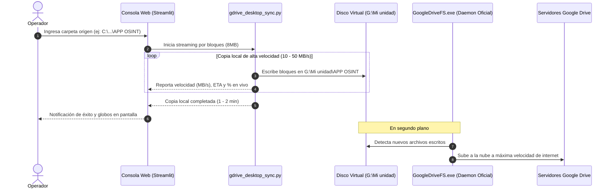

# 🌐 TELEGRAM OSINT RECON MATRIX & TURBO MEDIA DOWNLOADER

<div align="center">

```text
 ▄▄▄▄▄▄▄▄▄▄▄  ▄▄▄▄▄▄▄▄▄▄▄  ▄▄▄▄▄▄▄▄▄▄▄  ▄▄▄▄▄▄▄▄▄▄▄  ▄▄▄▄▄▄▄▄▄▄▄ 
▐░░░░░░░░░░░▌▐░░░░░░░░░░░▌▐░░░░░░░░░░░▌▐░░░░░░░░░░░▌▐░░░░░░░░░░░▌
▐░█▀▀▀▀▀▀▀█░▌ ▀▀▀▀█░█▀▀▀▀ ▐░█▀▀▀▀▀▀▀█░▌ ▀▀▀▀█░█▀▀▀▀ ▐░█▀▀▀▀▀▀▀▀▀ 
▐░▌       ▐░▌     ▐░▌     ▐░▌       ▐░▌     ▐░▌     ▐░▌          
▐░█▄▄▄▄▄▄▄█░▌     ▐░▌     ▐░▌       ▐░▌     ▐░▌     ▐░█▄▄▄▄▄▄▄▄▄ 
▐░░░░░░░░░░░▌     ▐░▌     ▐░▌       ▐░▌     ▐░▌     ▐░░░░░░░░░░░▌
▐░█▀▀▀▀▀▀▀▀▀      ▐░▌     ▐░▌       ▐░▌     ▐░▌      ▀▀▀▀▀▀▀▀▀█░▌
▐░▌               ▐░▌     ▐░▌       ▐░▌     ▐░▌               ▐░▌
▐░▌           ▄▄▄▄█░█▄▄▄▄ ▐░█▄▄▄▄▄▄▄█░▌ ▄▄▄▄█░█▄▄▄▄  ▄▄▄▄▄▄▄▄▄█░▌
▐░▌          ▐░░░░░░░░░░░▌▐░░░░░░░░░░░▌▐░░░░░░░░░░░▌▐░░░░░░░░░░░▌
 ▀            ▀▀▀▀▀▀▀▀▀▀▀  ▀▀▀▀▀▀▀▀▀▀▀  ▀▀▀▀▀▀▀▀▀▀▀  ▀▀▀▀▀▀▀▀▀▀▀ 
```

**Intelligence Gathering • High-Speed Topic Extractor • Cloud Turbo Sync • Cryptographic Deduplication**  
*Desarrollado y Creado por:* **`@lukgtz` (Luciano Gutiérrez)** &bull; *Salta, Argentina*

---

[](https://www.python.org/)
[](https://docs.telethon.dev/)
[](https://streamlit.io/)
[](https://www.google.com/drive/)
[](https://www.sqlite.org/)

</div>

---

## 📑 ÍNDICE DE CONTENIDOS

1. [🧭 Visión General](#-visión-general)
2. [⚡ Características Principales](#-características-principales)
3. [🏗️ Estructura del Proyecto & Explicación de Módulos](#️-estructura-del-proyecto--explicación-de-módulos)
4. [🛠️ Guía de Instalación y Configuración Paso a Paso (Para Cualquier PC)](#️-guía-de-instalación-y-configuración-paso-a-paso-para-cualquier-pc)
5. [🖥️ Manual Operativo de las 6 Pestañas (Web GUI)](#️-manual-operativo-de-las-6-pestañas-web-gui)
6. [🤖 Uso en Modo Bot de Telegram](#-uso-en-modo-bot-de-telegram)
7. [🗄️ Estructura de Datos, Archivos y Deduplicación](#️-estructura-de-datos-archivos-y-deduplicación)
8. [☁️ Sincronización Turbo con Google Drive (Cómo Funciona)](#️-sincronización-turbo-con-google-drive-cómo-funciona)
9. [❓ Preguntas Frecuentes & Solución de Problemas](#-preguntas-frecuentes--solución-de-problemas)
10. [📚 Documentación Técnica para Desarrolladores](#-documentación-técnica-para-desarrolladores)

---

## 🧭 VISIÓN GENERAL

**Telegram OSINT Recon Matrix & Turbo Media Extractor** es una plataforma profesional de nivel táctico desarrollada en Python. Combina:
1. **Extracción Concurrente Masiva:** Descarga gigabytes o terabytes de contenido multimedia (fotos, videos 4K, audios y documentos) desde canales, grupos y **foros organizados por temas (topics)** de Telegram.
2. **Centro de Reconocimiento e Inteligencia OSINT:** Inspección de metadatos, extracción de participantes, cálculo de patrones temporales de publicación y búsqueda profunda de palabras clave.
3. **Sincronización Cloud de Alto Rendimiento:** Transfiere carpetas del bot o **cualquier ruta arbitraria de la PC** hacia Google Drive por bloques optimizados de 8 MB con medición de velocidad en vivo y ETA.
4. **Deduplicación Criptográfica Doble-Capa:** Evita descargas redundantes mediante hashes SHA-256 en SQLite, ahorrando ancho de banda y espacio en disco.

---

## ⚡ CARACTERÍSTICAS PRINCIPALES

- 📥 **Extracción Concurrente:** Descarga en paralelo con control de semáforos (`asyncio.Semaphore`) y soporte para acelerador `cryptg`.
- 📂 **Soporte Nativo de Foros (Topics):** Identifica automáticamente los temas dentro de un foro, permite pre-análisis (conteo de fotos/videos, peso en MB y tiempo estimado) y descarga selectiva u holística con control de **Pausa / Reanudación**.
- 🔐 **Deduplicación SHA-256:** Base de datos SQLite (`downloads_hashes.db`) que registra la huella digital única de cada archivo.
- ☁️ **Google Drive Turbo Sync:**
  - Sincroniza carpetas descargadas por el bot en `downloads/`.
  - Sincroniza **cualquier carpeta de tu computadora** (ej: `C:\Users\LukGutierrez\Desktop\APP OSINT`, discos externos `D:\`, `E:\`, etc.).
  - Muestra velocidad en tiempo real (`MB/s`), tiempo restante (`ETA`), megabytes transferidos y barra de progreso.
- 🕵️ **Matriz OSINT Avanzada:**
  - Identificador de chats unidos con IDs numéricos negativos (`-100...`).
  - Ficha de perfil (`/info`): detección de cuentas falsas, verificadas, restringidas o scam.
  - Estadísticas de actividad (`/stats`): horas pico de publicación y distribución de formatos.
  - Buscador de texto clave para auditar filtraciones (DNI, CBU, credenciales, teléfonos).
- 🛡️ **Evasión & Privacidad:** Enrutamiento transparente a través de proxies SOCKS5, SOCKS4, HTTP y MTProto.
- 🎨 **Consola Cyber Terminal OLED:** Tema visual táctico `#050505` con tipografía monoespaciada, métricas neón y firma del creador `@lukgtz`.

---

## 🏗️ ESTRUCTURA DEL PROYECTO & EXPLICACIÓN DE MÓDULOS

```text
Bot Telegram/
├── app_web.py             # 🌐 Consola Web Streamlit (6 Pestañas, GUI Cyber Terminal)
├── bot.py                 # 🤖 Servidor de Comandos para Telegram
├── downloader.py          # ⚡ Motor de Descargas Concurrentes y Sanitización
├── osint.py               # 🕵️ Motor de Inteligencia OSINT y Reconocimiento
├── link_parser.py         # 🔗 Parser Universal de Enlaces, Usernames e IDs
├── hash_dedup.py          # 🔐 Motor de Deduplicación Criptográfica SQLite (SHA-256)
├── gdrive_desktop_sync.py # 💻 Motor de Sincronización Local Google Drive (8MB Chunks)
├── gdrive_uploader.py     # ☁️ Cliente Google Drive API v3 (Resumable Upload)
├── proxy_manager.py       # 🛡️ Gestor y Enrutador de Conexiones Proxy
├── config.py              # ⚙️ Cargador de Variables de Entorno (.env) y Fallbacks
├── requirements.txt       # 📦 Lista de Dependencias Oficiales de Python
├── .env.example           # 🔒 Plantilla de Configuración de Credenciales
├── .gitignore             # 🛡️ Blindaje de Seguridad contra Fugas en Git
├── AGENTS.md              # 🤖 Arquitectura Técnica para Agentes de IA / Devs
├── GUIA_DE_USO.md         # 📖 Manual de Operación Detallado en Español
└── README.md              # 📄 Documentación Principal del Proyecto
```

### 🔍 ¿Para qué sirve cada módulo?

| Módulo | Responsabilidad y Funcionamiento |
| :--- | :--- |
| **`app_web.py`** | Punto de entrada visual. Implementa la interfaz Streamlit con 6 pestañas, gestiona el bucle asíncrono en segundo plano (`daemon thread`) y utiliza `MemorySession` para desacoplar las sesiones SQLite de Telethon, garantizando cero bloqueos de base de datos. |
| **`bot.py`** | Punto de entrada del Bot de Telegram. Escucha y procesa comandos interactivos (`/start`, `/dl`, `/batch`, `/topics`, `/alltopics`, `/info`, `/stats`, `/recent`, `/participants`, `/mygroups`). |
| **`downloader.py`** | Gestiona la descarga asíncrona de archivos multimedia desde la MTProto API de Telegram. Controla la concurrencia, renombra archivos con formato determinista (`YYYYMMDD_HHMMSS_{msg_id}_{filename}`) y reporta el progreso en vivo. |
| **`osint.py`** | Motor de investigación. Realiza peticiones a la API para inspeccionar perfiles de usuario, canales, permisos, estadísticas de mensajería, conteo de miembros y búsqueda de texto. |
| **`link_parser.py`** | Analiza cadenas de texto para extraer enlaces públicos (`t.me/canal/123`), privados (`t.me/c/1234567/123`), enlaces de invitación (`t.me/+hash`), nombres de usuario (`@usuario`) o IDs numéricos. |
| **`hash_dedup.py`** | Calcula el hash SHA-256 de los archivos en bloques de 64 KB y los registra en `downloads_hashes.db`. Si un archivo ya existe, evita volver a descargarlo. |
| **`gdrive_desktop_sync.py`** | Detecta la unidad montada de Google Drive para Computadoras (`G:\Mi unidad`) y realiza una copia directa por streaming de 8 MB por bloque, calculando velocidad real (MB/s) y tiempo estimado (ETA). |
| **`gdrive_uploader.py`** | Proporciona subida directa a Google Drive mediante la API REST v3 oficial con soporte para subidas reanudables (`Resumable Upload`) en bloques de 64 MB / 128 MB. |
| **`proxy_manager.py`** | Configura conexiones proxy SOCKS5 o MTProto para Telethon, permitiendo operar de forma anónima o evadir bloqueos de red. |
| **`config.py`** | Centraliza la configuración del sistema, cargando variables desde el entorno del sistema o desde un archivo `.env` mediante `python-dotenv`. |

---

## 🛠️ GUÍA DE INSTALACIÓN Y CONFIGURACIÓN PASO A PASO (PARA CUALQUIER PC)

Si tú o cualquier otra persona desean instalar y ejecutar este sistema desde cero en cualquier computadora (Windows, Linux o macOS), sigan estos pasos:

### 1. Requisitos Previos
- **Python 3.10 o superior** ([Descargar de python.org](https://www.python.org/downloads/)).
- **Git** ([Descargar de git-scm.com](https://git-scm.com/)).
- *(Opcional para Google Drive Turbo Sync)*: **Google Drive para Computadoras** ([Descargar oficial de Google](https://www.google.com/intl/es/drive/download/)).

---

### 2. Obtener las Credenciales de Telegram (Gratis)
Para que el bot pueda conectarse a la red de Telegram necesitas tus claves de API:

1. Ingresa a **[https://my.telegram.org](https://my.telegram.org)** e inicia sesión con tu número de teléfono.
2. Haz clic en **"API development tools"**.
3. Completa los campos solicitados (Nombre y Nombre corto de la app) y haz clic en **"Create application"**.
4. Copia tu **`api_id`** (número entero) y tu **`api_hash`** (cadena alfanumérica de 32 caracteres).
5. *(Opcional si vas a usar `bot.py`)*: Abre Telegram, busca al bot oficial **`@BotFather`**, envía `/newbot` y obtén tu **`BOT_TOKEN`**.

---

### 3. Clonar el Proyecto e Instalar Dependencias

Abre tu terminal (PowerShell, CMD o Terminal de Linux) y ejecuta:

```bash
# 1. Clonar el repositorio
git clone https://github.com/TU_USUARIO/telegram-osint-matrix.git
cd telegram-osint-matrix

# 2. Crear un entorno virtual aislado (Recomendado)
python -m venv venv

# 3. Activar el entorno virtual
# En Windows (PowerShell):
.\venv\Scripts\Activate.ps1
# En Windows (CMD):
.\venv\Scripts\activate.bat
# En Linux / macOS:
source venv/bin/activate

# 4. Instalar todas las librerías necesarias
pip install -r requirements.txt
```

---

### 4. Configurar el Archivo `.env`

Copia la plantilla de configuración:
```bash
# En Windows:
Copy-Item .env.example .env

# En Linux / macOS:
cp .env.example .env
```

Abre el archivo `.env` con un editor de texto (Notepad, VS Code, Nano) y completa tus claves:

```env
# --- CREDENCIALES TELEGRAM ---
TELEGRAM_API_ID=12345678
TELEGRAM_API_HASH=0123456789abcdef0123456789abcdef
TELEGRAM_BOT_TOKEN=1234567890:AAFlStLnD9tEyChkGr7ybRWbrDtgf0hM44I

# --- RENDIMIENTO & DESCARGAS ---
MAX_CONCURRENT_DOWNLOADS=10
DOWNLOAD_FOLDER=downloads
MAX_FILE_SIZE_MB=50
MAX_FLOOD_WAIT=300

# --- DEDUPLICACIÓN ---
DEDUP_ENABLE=true
HASH_ALGORITHM=sha256

# --- PROXY (OPCIONAL) ---
PROXY_ENABLED=false
PROXY_TYPE=SOCKS5
PROXY_HOST=127.0.0.1
PROXY_PORT=1080
```

---

### 5. Iniciar la Aplicación

#### Opción A: Iniciar la Consola Web Táctica (Recomendado)
```bash
streamlit run app_web.py
```
> **Nota de Primera Ejecución:** La primera vez que inicies sesión, la terminal te solicitará ingresar tu número de teléfono (con código de país, ej: `+549387...`) y el código de seguridad que Telegram te enviará. Una vez ingresado, la sesión quedará guardada de forma segura y no te lo volverá a pedir.

#### Opción B: Iniciar el Bot de Telegram
```bash
python bot.py
```

---

## 🖥️ MANUAL OPERATIVO DE LAS 6 PESTAÑAS (WEB GUI)

```text
┌──────────────────────────────────────────────────────────────────────────────────┐
│ [🚀 RÁPIDO] [📂 FOROS/TOPICS] [☁️ DRIVE TURBO] [🕵️ OSINT] [📖 MANUAL] [⚙️ CONFIG]  │
└──────────────────────────────────────────────────────────────────────────────────┘
```

### 🚀 Pestaña 1: DESCARGADOR RÁPIDO
- **Objetivo:** Descargar archivos específicos o lotes pequeños de canales y grupos.
- **Instrucciones:**
  1. Pega un enlace (ej: `https://t.me/canal/123`, `@canal/45` o ID numérico).
  2. Selecciona **"Mensaje Único"** o **"Lote Reciente (Batch)"** (eligiendo la cantidad de mensajes a revisar con el slider).
  3. Presiona **`⚡ INICIAR EXTRACCIÓN`**.

---

### 📂 Pestaña 2: DESCARGADOR DE FOROS (TOPICS)
- **Objetivo:** Extraer de forma estructurada todo el contenido de grupos de Telegram con formato Foro (hilos de discusión).
- **Instrucciones:**
  1. Ingresa el ID numérico del grupo foro (ej: `-1004340179079`).
  2. Presiona **`📋 CARGAR LISTA DE TOPICS`** para enumerar todos los hilos del foro.
  3. *(Opcional)* Haz clic en **`🔍 PRE-ANÁLISIS Y TIEMPO`** para generar un reporte previo: desglose de cuántas fotos, videos y documentos contiene cada topic, tamaño total en MB y tiempo estimado de descarga.
  4. Selecciona topics individuales en la lista o haz clic en **`⚡ DESCARGAR TODOS`**.
  5. Usa **`🛑 PAUSAR DESCARGA`** o **`▶️ REANUDAR DESCARGA`** según necesites.

---

### ☁️ Pestaña 3: DRIVE TURBO UPLOADER (10GB+)
- **Objetivo:** Sincronizar archivos pesados hacia Google Drive sin límites de tamaño, sin riesgo de desconexión y con cero consumo de RAM.
- **Modos de Sincronización:**
  - **Modo 1: Carpeta descargada por el Bot (`downloads/`):** Selecciona directamente del desplegable la carpeta que acabas de descargar.
  - **Modo 2: Cualquier carpeta de tu PC:** Pega cualquier ruta de tu disco (ej: `C:\Users\LukGutierrez\Desktop\APP OSINT` o `D:\MisVideos`).
- **Métricas en Vivo:** El sistema calcula y muestra en tiempo real:
  - ⚡ **VELOCIDAD (MB/s)**
  - ⏱️ **TIEMPO RESTANTE (ETA)**
  - 📊 **TRANSFERIDO (MB / Total MB)**
  - 📄 **Archivo en proceso actual**

---

### 🕵️ Pestaña 4: CENTRO OSINT
- **Objetivo:** Inteligencia sobre objetivos en Telegram.
- **Herramientas disponibles:**
  - **📋 Visor de Mis Grupos:** Lista todos los chats a los que pertenece tu cuenta y muestra sus IDs negativos (`-100...`).
  - **📋 Ficha de Información (`/info`):** Analiza username, ID, flags de restricción, estado de verificación y chats en común.
  - **📈 Estadísticas (`/stats`):** Muestra el porcentaje de fotos vs videos, días de mayor actividad y horarios pico.
  - **💬 Mensajes Recientes (`/recent`):** Visualiza los últimos mensajes publicados.
  - **👥 Miembros (`/members`):** Extrae la nómina de usuarios del canal/grupo.
  - **🔍 Búsqueda de Palabras Clave:** Busca términos específicos dentro de canales históricos (CBUs, DNIs, teléfonos, nombres).

---

### 📖 Pestaña 5: MANUAL DE COMANDOS
- Resumen interactivo con la sintaxis de todos los comandos disponibles para utilizar directamente en la app de Telegram.

---

### ⚙️ Pestaña 6: CONFIGURACIÓN & PROXIES
- Panel de control de la base de datos de **Deduplicación SHA-256** (muestra archivos registrados y megabytes ahorrados).
- Configuración de proxies (SOCKS5, SOCKS4, HTTP, MTProto) con host, puerto y credenciales de autenticación.

---

## 🤖 USO EN MODO BOT DE TELEGRAM

Si ejecutas `python bot.py`, puedes interactuar directamente con tu bot desde Telegram mediante los siguientes comandos:

| Comando | Sintaxis de Ejemplo | Acción |
| :--- | :--- | :--- |
| `/start` | `/start` | Inicia el bot y despliega el menú principal. |
| `/dl` | `/dl https://t.me/canal/123` | Descarga el archivo del mensaje indicado. |
| `/batch` | `/batch https://t.me/canal/50 20` | Descarga los últimos 20 archivos multimedia. |
| `/topics` | `/topics -1004340179079` | Lista los temas de un foro con sus IDs. |
| `/alltopics` | `/alltopics -1004340179079` | Descarga todos los topics ordenados en subcarpetas. |
| `/info` | `/info @usuario` | Muestra la ficha de inteligencia OSINT. |
| `/stats` | `/stats https://t.me/canal` | Muestra gráficos de horarios pico y hábitos del canal. |
| `/mygroups` | `/mygroups` | Muestra la lista de tus grupos con sus IDs numéricos. |
| `/recent` | `/recent @canal 15` | Muestra los textos de los últimos 15 mensajes. |
| `/participants` | `/participants @grupo` | Lista participantes del grupo. |

---

## 🗄️ ESTRUCTURA DE DATOS, ARCHIVOS Y DEDUPLICACIÓN

### 📁 Organización de Descargas en Disco
Todos los archivos se guardan siguiendo un esquema determinista para evitar sobreescrituras accidentales y mantener un orden estricto:

```text
downloads/
└── [Nombre_Del_Canal_O_Grupo]/
    ├── [Nombre_Del_Topic_1]/
    │   ├── 20260906_143022_105_video_operacion.mp4
    │   └── 20260906_143110_106_evidencia.jpg
    └── [Nombre_Del_Topic_2]/
        └── 20260906_150000_120_reporte.pdf
```

- **Patrón de nombrado:** `YYYYMMDD_HHMMSS_{msg_id}_{filename_sanitizado}`
- **Sanitización de rutas:** Se eliminan caracteres no válidos para Windows/Linux (`\ / : * ? " < > |`).

### 🔐 Motor de Deduplicación Criptográfica SQLite
El sistema utiliza una base de datos local SQLite (`downloads_hashes.db`) con la siguiente estructura:

```sql
CREATE TABLE IF NOT EXISTS file_hashes (
    id INTEGER PRIMARY KEY AUTOINCREMENT,
    file_hash TEXT UNIQUE,
    file_name TEXT,
    file_size INTEGER,
    file_path TEXT,
    download_date TIMESTAMP DEFAULT CURRENT_TIMESTAMP
);
```

- **Cálculo de Hash:** Cada archivo se procesa en bloques de 64 KB para generar su firma SHA-256 sin consumir exceso de memoria RAM.
- **Ahorro de Ancho de Banda:** Antes de descargar un archivo, el sistema comprueba su firma; si ya existe en disco o en la base de datos, se omite de forma instantánea.

---

## ☁️ SINCRONIZACIÓN TURBO CON GOOGLE DRIVE (CÓMO FUNCIONA)

El sistema implementa una arquitectura híbrida de sincronización:



### Ventajas de este Método:
1. **0 Errores de Autenticación / OAuth:** No requiere refrescar tokens web expirados ni lidiar con límites de cuota de API.
2. **Soporta Archivos de 10 GB a 100 GB+:** La copia a `G:\Mi unidad` es local e instantánea; el daemon oficial de Google gestiona la subida por partes y reintentos ante caídas de internet.
3. **Cero Consumo de RAM en la Web GUI:** La memoria de la consola se mantiene limpia.

---

## ❓ PREGUNTAS FRECUENTES & SOLUCIÓN DE PROBLEMAS

### 1. ¿Por qué la consola web dice que ya terminó de sincronizar pero en la web de Google Drive todavía no aparecen todos los archivos?
La consola web realiza una copia a tu disco virtual local `G:\Mi unidad` a velocidades de disco (**10 a 50 MB/s**). Una vez que los archivos están en `G:\`, la aplicación **Google Drive para Escritorio** toma el control y los sube a la nube a la velocidad de tu conexión a internet. Puedes verificar el progreso en el icono de Google Drive junto al reloj de Windows.

### 2. ¿Cómo cambio de cuenta de Google Drive?
1. Haz clic derecho en el icono de Google Drive en la barra de tareas de Windows.
2. Abre **Preferencias** (icono de engranaje ⚙️).
3. Haz clic en tu avatar y selecciona **"Desconectar cuenta"** o **"Agregar otra cuenta"**.

### 3. ¿Cómo comparto una carpeta subida con un enlace público?
1. Entra a [drive.google.com](https://drive.google.com) o abre `G:\Mi unidad`.
2. Clic derecho en la carpeta -> **Compartir** -> **Compartir**.
3. En *"Acceso general"*, cambia a **"Cualquier persona con el enlace"**.
4. Haz clic en **Copiar enlace**.

### 4. ¿Qué hago si Telegram muestra el error `FloodWaitError`?
El sistema captura automáticamente los errores de FloodWait y espera pacientemente los segundos requeridos por Telegram antes de reanudar la operación, evitando que tu cuenta sea bloqueada.

---

## 📚 DOCUMENTACIÓN TÉCNICA FORMAL & ESPECIFICACIONES

- 🤖 **[`agent.md`](agent.md):** Rol del agente de IA, stack técnico de ingeniería y reglas inmutables de desarrollo.
- 📋 **[`specs/01-requerimientos.md`](specs/01-requerimientos.md):** Requerimientos funcionales y no funcionales del sistema v2.0.
- 🧭 **[`specs/02-flujo-usuario.md`](specs/02-flujo-usuario.md):** Diagrama de secuencia y recorrido operativo de la consola web.
- 🏗️ **[`specs/03-arquitectura.md`](specs/03-arquitectura.md):** Arquitectura modular, flujo de datos y dependencias clave.
- 🗄️ **[`specs/04-modelo-datos.md`](specs/04-modelo-datos.md):** Esquema SQLite de deduplicación y organización determinista de archivos.
- 📜 **[`docs/DECISIONS.md`](docs/DECISIONS.md):** Registro histórico de Decisiones de Arquitectura (ADR-001 a ADR-004).
- 📊 **[`docs/STATE.md`](docs/STATE.md):** Estado operativo actual y verificación de hitos.
- 📖 **[`GUIA_DE_USO.md`](GUIA_DE_USO.md):** Manual extendido en español para usuarios finales y administradores de sistemas.

---

## ☁️ EDICIÓN CLOUD & APP MÓVIL (Versión 3.0)

Para la versión empresarial distribuida 24/7 en servidores en la nube con **App Móvil Android (Flutter Release APK), Docker Compose, PostgreSQL 16, Redis 7 y WebSockets en tiempo real**, consulta el repositorio complementario:

👉 **[Telegram-Media-Hub-v3.0-Cloud-Mobile](https://github.com/lukgutierrez/Telegram-Media-Hub-v3.0-Cloud-Mobile)**

---

<div align="center">

**TELEGRAM OSINT RECON MATRIX & TURBO MEDIA DOWNLOADER v2.0**  
*Desarrollado con rigor técnico por:* **`@lukgtz` (Luciano Gutiérrez)**  
*Salta, Argentina &bull; 2026*

</div>

