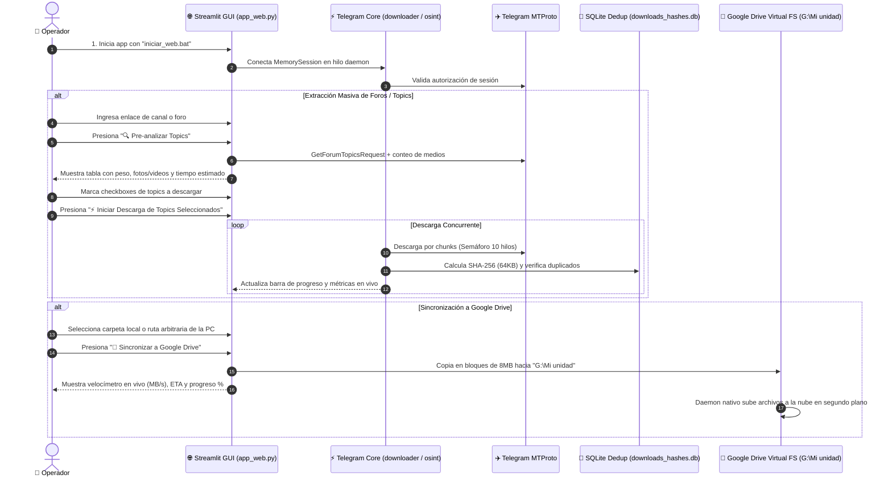

# 🧭 02 — Flujo de Usuario (v2.0 Desktop)

> **Proyecto:** BOT-Telegram-OSINT-Matrix-Turbo-Downloader-v2.0  
> **Versión:** 2.0.0 Desktop

---

## 🌊 Flujo Operativo en la Consola Web (Streamlit)

```mermaid
sequenceDiagram
    autonumber
    actor User as 👤 Operador
    participant GUI as 🌐 Streamlit GUI (app_web.py)
    participant Core as ⚡ Telegram Core (downloader / osint)
    participant TG as ✈️ Telegram MTProto
    participant Dedup as 🔐 SQLite Dedup (downloads_hashes.db)
    participant Drive as 💾 Google Drive Virtual FS (G:\Mi unidad)

    %% Inicio
    User->>GUI: 1. Inicia app con "iniciar_web.bat"
    GUI->>Core: Conecta MemorySession en hilo daemon
    Core->>TG: Valida autorización de sesión

    %% Caso A: Descarga / Topics
    alt Extracción Masiva de Foros / Topics
        User->>GUI: Ingresa enlace de canal o foro
        User->>GUI: Presiona "🔍 Pre-analizar Topics"
        GUI->>TG: GetForumTopicsRequest + conteo de medios
        GUI-->>User: Muestra tabla con peso, fotos/videos y tiempo estimado
        User->>GUI: Marca checkboxes de topics a descargar
        User->>GUI: Presiona "⚡ Iniciar Descarga de Topics Seleccionados"
        loop Descarga Concurrente
            Core->>TG: Descarga por chunks (Semáforo 10 hilos)
            Core->>Dedup: Calcula SHA-256 (64KB) y verifica duplicados
            Core-->>GUI: Actualiza barra de progreso y métricas en vivo
        end
    end

    %% Caso B: Sincronización Google Drive
    alt Sincronización a Google Drive
        User->>GUI: Selecciona carpeta local o ruta arbitraria de la PC
        User->>GUI: Presiona "🚀 Sincronizar a Google Drive"
        GUI->>Drive: Copia en bloques de 8MB hacia "G:\Mi unidad"
        GUI-->>User: Muestra velocímetro en vivo (MB/s), ETA y progreso %
        Drive->>Drive: Daemon nativo sube archivos a la nube en segundo plano
    end
```
