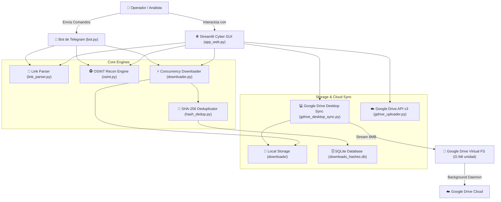

# 🏗️ 03 — Arquitectura del Sistema (v2.0 Desktop)

> **Proyecto:** BOT-Telegram-OSINT-Matrix-Turbo-Downloader-v2.0  
> **Versión:** 2.0.0 Desktop

---

## 📐 Diagrama de Arquitectura de Módulos

---

## 🧩 Especificación de Módulos

| Módulo | Responsabilidad |
| :--- | :--- |
| `app_web.py` | Consola Web Streamlit interactiva con 6 pestañas, métricas en vivo, gráficos y gestión de descargas. |
| `bot.py` | Servidor de comandos de Telegram (`/dl`, `/batch`, `/topics`, `/info`, `/stats`, `/sync`). |
| `downloader.py` | Motor de descarga con `asyncio.Semaphore`, aceleración `cryptg` y reintentos automáticos. |
| `osint.py` | Inspección forense de canales/grupos, conteo de fotos/videos/docs, horarios pico y búsqueda de palabras clave. |
| `gdrive_desktop_sync.py` | Copia de alta velocidad por bloques (8MB) hacia `G:\Mi unidad` con telemetría en vivo. |
| `hash_dedup.py` | Deduplicación SQLite con cálculo de hashes SHA-256 en bloques de 64KB. |
