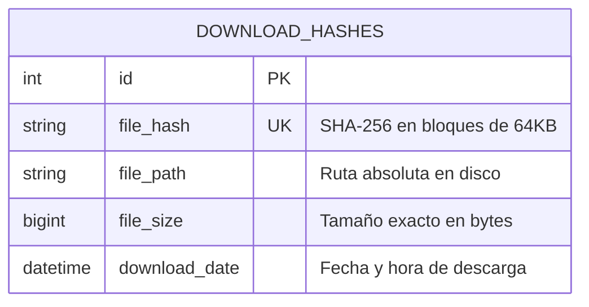

# 🗄️ 04 — Modelo de Datos y Esquema SQLite (v2.0 Desktop)

> **Proyecto:** BOT-Telegram-OSINT-Matrix-Turbo-Downloader-v2.0  
> **Versión:** 2.0.0 Desktop

---

## 🏛️ Esquema de Base de Datos SQLite (`downloads_hashes.db`)



### Definición SQL:

```sql
CREATE TABLE IF NOT EXISTS downloads (
    id INTEGER PRIMARY KEY AUTOINCREMENT,
    file_hash TEXT UNIQUE NOT NULL,
    file_path TEXT NOT NULL,
    file_size INTEGER NOT NULL,
    download_date TIMESTAMP DEFAULT CURRENT_TIMESTAMP
);

CREATE INDEX IF NOT EXISTS idx_file_hash ON downloads(file_hash);
```

---

## 📁 Estructura de Directorios en Disco

Los archivos descargados se organizan de forma determinista y limpia:

```text
downloads/
├── <Nombre_Canal_O_Grupo>/
│   ├── <Nombre_Topic_1>/
│   │   ├── YYYYMMDD_HHMMSS_<msg_id>_<nombre_archivo>.mp4
│   │   └── YYYYMMDD_HHMMSS_<msg_id>_<nombre_archivo>.jpg
│   └── <Nombre_Topic_2>/
│       └── YYYYMMDD_HHMMSS_<msg_id>_<nombre_archivo>.pdf
└── <Nombre_Canal_Sin_Topics>/
    ├── YYYYMMDD_HHMMSS_<msg_id>_<nombre_archivo>.mp4
    └── YYYYMMDD_HHMMSS_<msg_id>_<nombre_archivo>.jpg
```
